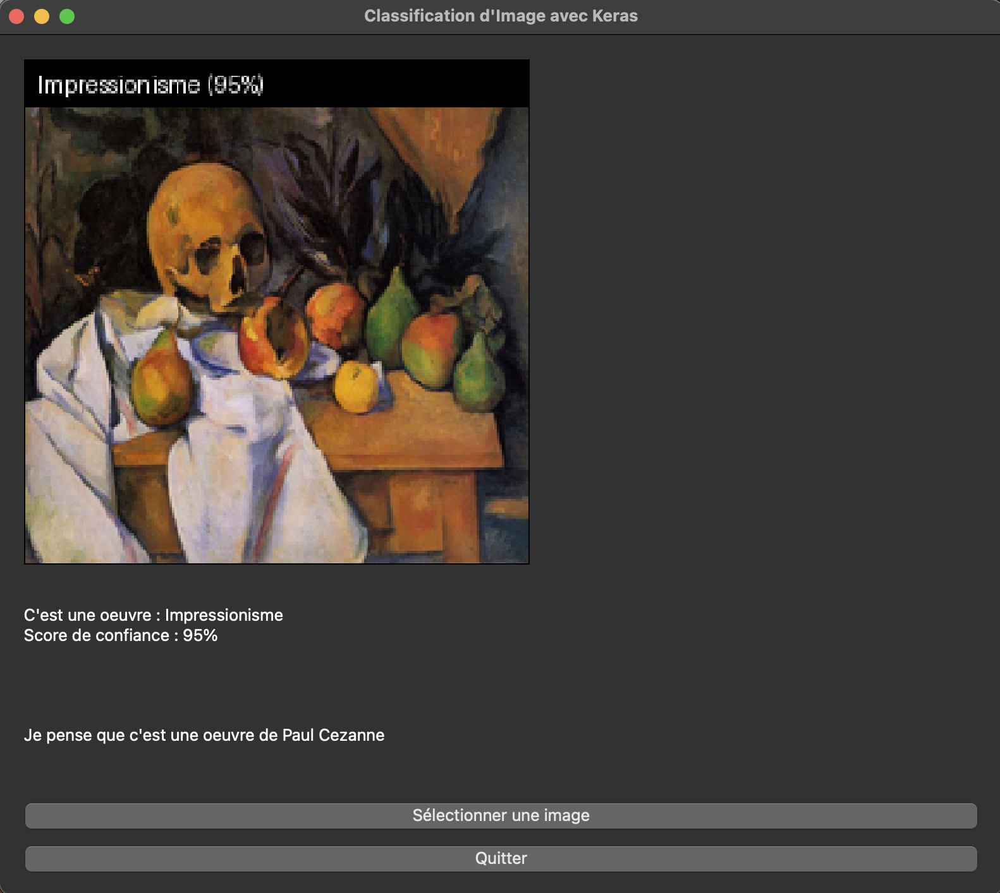

# Identify art with Classification AI Model to detect if it's cubism art or impressionist art or other

> Exemple of usage:



## AI Model usage

Training of 2 models on Teachable Machine [link](https://teachablemachine.withgoogle.com)

The first model: **/typeOfArt** -> of image classification trained with 3 classes (*Cubisme, Impressionime and Autre*)

The second model: **/wichArtist** of image classification trained with 9 classes (*Picasso, Juan Gris, Georges Braque, Monet, August renoir, Paul Cezanne, Art abstrait, Fauvisme, Art Pop*)

## How to use

### Need to install requirements

```bash
pip install -r requirements.txt
```

### After launching the application

**Upload** image or **drag and drop**, detect and let's see if it's cubism art or impressionist art, or other type of art
